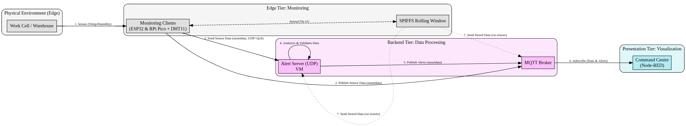

# COMCS.Lda Monitoring Solution

## Problem (what)
The overall goal is to develop a monitoring solution for COMCS.Lda, a company that needs to ensure its temperature- and humidity-sensitive products are maintained at constant levels during production and storage.

## Solution (how)

### Arquitecture


## How to run

### Edge Tier
Just connect both devices to power

### Alert Server
#### Compile & run
```
make && ./alert
```
#### Run Tests
```
make test
```

### NodeRed
Have NodeRed running and then go to http://localhost:1880/ui

## Group Composition
### 1250446 - Vitor Hugo Santos
### 1251952 - Carolina Tabosa