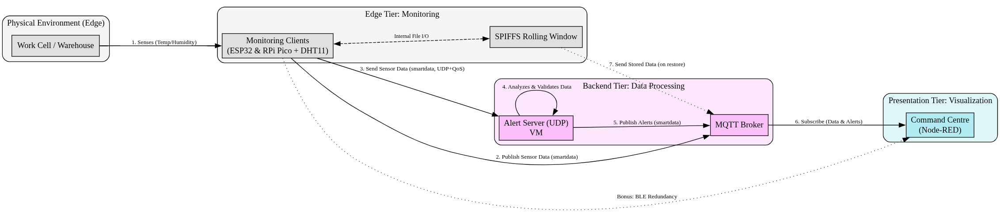

# COMCS.Lda Monitoring Solution

## Problem (what)
The overall goal is to develop a monitoring solution for COMCS.Lda, a company that needs to ensure its temperature- and humidity-sensitive products are maintained at constant levels during production and storage.

## Solution (how)

### Arquitecture

